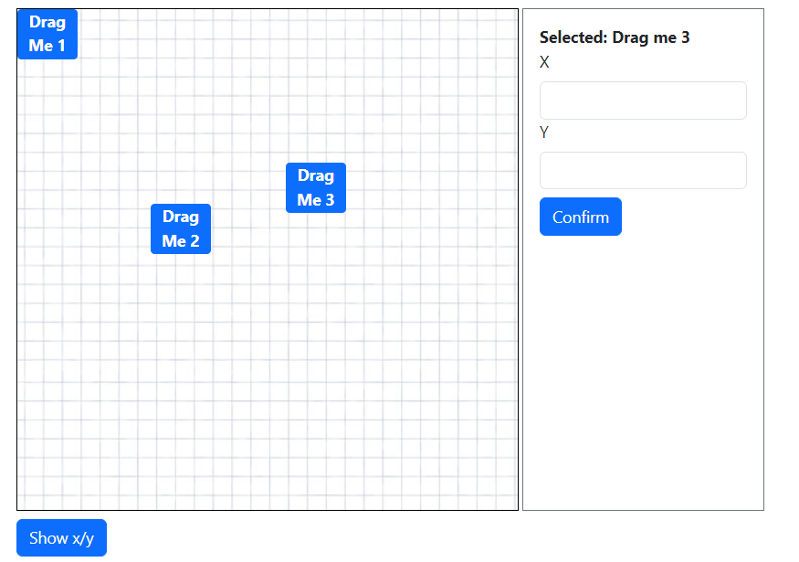

# React Drag and Drop Workspace Demo

## Setup and run
* Ensuring having npm in your pc
* Open this project, Run cmd in vscode: Ctrl + Shift + `
* Run project: `npm start`

## Gioi thieu ngan

* Mục tiêu của demo là tạo các khối kéo thả, với mỗi vị trí trên whitespace của khối, track lại vị trí và lưa vào state
* Show x/y: console log property state lưu trữ
* Form bên phải: nhập toạ độ của box cần thay đổi và nhấn enter, box sẽ tự cập nhật toạ độ mới

## Các phần cẩn cải tiến
* cơ chế z-index, lớp cho các box
* Làm mượt việc kéo thả
* Bỏ một số code vào components