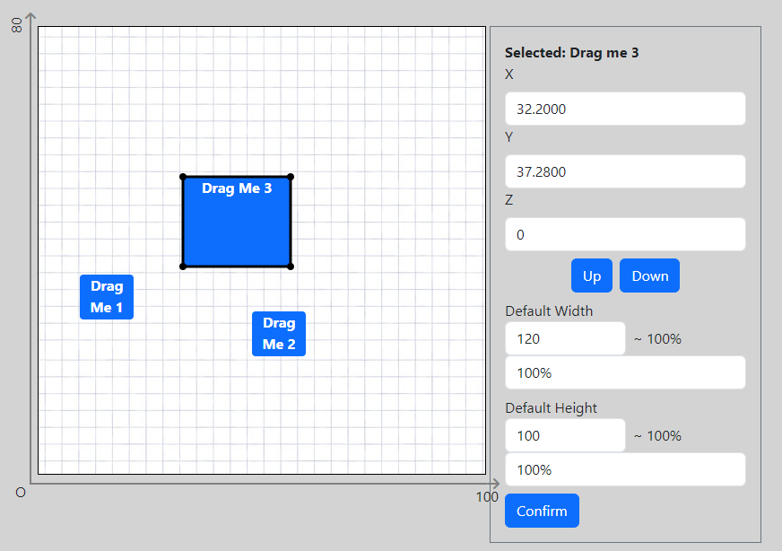

# Giải thích module kéo thả Drag Drop các element trong bảng trắng


## Giới thiệu ngắn


[Link website demo](https://demo-drag-and-drop.vercel.app/)

* Mục tiêu của demo là tạo các khối kéo thả, với mỗi vị trí trên whitespace của khối, track lại vị trí và lưa vào state
* Show x/y: console log property state lưu trữ
* Form bên phải
  * x,y: nhập toạ độ của box cần thay đổi và nhấn enter, box sẽ tự cập nhật toạ độ mới 
  * z: level của lớp chồng nhau, có thể tăng giảm
  * Default width, height: set mặc định -> từ đó suy ra tỉ trọng bằng các lấy width, height hiện tại chia cho default

> Trong file readme này em sẽ giải thích theo trình tự đọc code để dễ hiểu nhất, ngoài ra em còn có comment trong code nên mn chú ý nhé
## Các file của module
* **Whitespace**.js: là khung chứa các object kéo thả
* **Box.js**: là object kéo thả (vì demo nên em đặt tên là Box, quy ước chung thì mn có thể đặt là Element)
* File css các phần trong module (nằm bên dưới cùng của file readme)

## App.js
Cấu trúc data cần truyền vào whitpsace => element
```js
const [coors, setCoors] = useState([
    // box 1
    {
      id: 1,
      x: 0, // các giá trị x,y sẽ được giải thích kỹ hơn trong Box.js
      y: 0,
      dw: 60,
      dh: 60,
      w: 60,
      h: 50,
      isSelected: false,
      z: 0
    },
  ]);
```
Các hàm thao tác
* **updateCoors**: truyền trực tiếp vào element, khi element đƯợc kéo thả và tại thời điểm buông ra, nó sẽ cập nhật state data
* **handleSubmit**: xử lý form bên phải 

Các tham số truyền vào component
```js
{/* Whitespace chính */}
<DraggableWhitespace
    coors={coors}
    setCoors={setCoors}
    coorRatio={coorRatio} // coorRatio là giá trị tối đa của thanh x và y, ví dụ thanh y là cột điểm có giá trị tối đa là 10
    setRatio={setRatio}
    updateCoors = {updateCoors} 
></DraggableWhitespace>
```

## Whitespace.js

Xem comment trong code


## Box.js
Giải thích về giá trị tuyệt đối và tương đổi trong mô hình kéo thả
* **x, y tuyệt đối**: là x,y được tính theo gốc toạ độ mặc định (do thuộc tính position: absolute) trên góc bên trái trên cùng
* **x,y tương đối**: là x,y tính so với góc bên trái dướI cùng

> Trong data state là lưu giá trị TƯƠNG ĐỐI

### Cơ chế kéo thả
Khi nhấp chuột down trên một box, nó sẽ track vị trí hiện tại của chuột và add listener cho hành động kéo, và khi kéo chuột, hệ thống sẽ tính liên tục khoảng cách mà chuột đã di chuyển, rồi tính (cộng hoặc trừ trực tiếp) vào giá trị left và top của obj, tại thời điểm mà ta nhả chuột ra, nó sẽ xét giá trị hiện tại của left và top và cập nhật giá trị tương đối vào state. Thứ tự xem handleMouseDown -> handleMouseMove -> handleMouesUp.

### Cơ chế resize

Tương tự cơ chế kéo thả, nhưng thay vì thay đổi các prop `left và right` , ta thay đổi giá trị width và height. Xem mô tả trong code


## Kết
Vì code khá là phức tạp và hoạt động dự trên một format cấu trúc data nhất định nên việc tích hợp vào các prj với những yêu cầu khác nhau cần chỉnh lại một só biến. Nếu có thắc mắc gì thì mn cứ liên hệ cho em nhé.

## References
* CSS module
```css
.whitespace{
  display: inline-block;
  position: relative;
  z-index: 1;
}
.box{
  color: white;
  font-weight: 700;
  cursor:grab;
  user-select: none;
  border-radius: 4px;
  box-sizing: border-box;
  position: absolute;
  transform: translate(var(--left), var(--top));
  transform-origin: bottom left;
}

.resizer{
  position: absolute;
  background-color: black;
}

.resizer-left{
  left:0;
  top: 50%;
  transform: translateY(-50%);
  width: 1.5px;
  height: 100%;
  cursor:col-resize;
}
.resizer-right{
  width: 1.5px;
  right: 0;
  top: 50%;
  transform: translateY(-50%);
  height: 100%;
  cursor:col-resize;
}
.resizer-top{
  top :0;
  left: 50%;
  transform: translateX(-50%);
  height: 1.5px;
  width: 100%;
  cursor: row-resize;
}
.resizer-bottom{
  bottom: 0;
  left: 50%;
  transform: translateX(-50%);
  height: 1.5px;
  width: 100%;
  cursor: row-resize;
}
.round-resizer {
  width: .5rem;
  /* padding-top: 100%; */
  height: .5rem;
  border-radius: 50%;
}
.resizer-topleft{
  cursor: nwse-resize;
  top: -.2rem;
  left: -.2rem;
} 

.resizer-topright{
  cursor: nesw-resize;
  right: -.2rem;
  top: -.2rem;
} 
.resizer-bottomleft{
  cursor: nesw-resize;
  left: -.2rem;
  bottom: -.2rem;
}
.resizer-bottomright{
  cursor: nwse-resize;
  right: -.2rem;
  bottom: -.2rem;

}
```